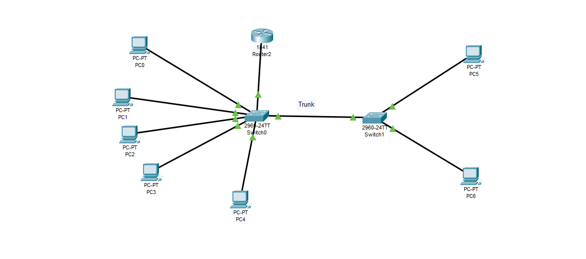

# Simple LAN Network Project

## Overview
This project demonstrates a basic Local Area Network (LAN) setup using Cisco Packet Tracer. 
The network consists of PCs, switches, and a router connected in a simple topology suitable 
for learning networking fundamentals and practicing configuration.

## Network Topology
- **Router**: 1 unit
- **Switches**: 2 units (Switch0 and Switch1)
- **PCs**: 8 units (PC0 to PC7)
- **Connections**: PCs are connected to switches, switches are connected via a trunk, 
  and one switch connects to the router for external connectivity.

## Purpose
- Practice IP addressing and subnetting
- Learn how to connect multiple PCs through switches
- Understand trunk links and router connectivity
- Basic hands-on experience with Cisco Packet Tracer

## local area Network

## Tools Used
- Cisco Packet Tracer

## Learning Outcomes
- Configure devices in a LAN
- Assign IP addresses to PCs
- Verify connectivity using ping
- Understand switch-to-switch trunking
- Practice network troubleshooting basics
