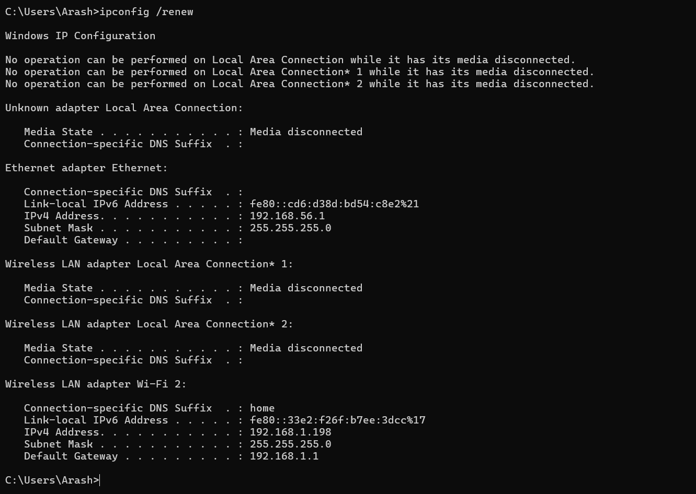

# سناریو: مشکل IP Conflict

## شرح مشکل
دو دستگاه در شبکه، یک IP مشابه دارند و باعث قطع اتصال یا رفتار غیرمنتظره می‌شوند.

## علائم
- اتصال شبکه گاه‌به‌گاه قطع می‌شود
- پیغام خطا: "IP address conflict" در سیستم

## راه‌حل ساده (Network+ level)
1. اجرای `ipconfig /all` و بررسی IP هر دستگاه
2. اطمینان از اینکه هر دستگاه IP منحصر به فرد دارد
3. در صورت نیاز، IP سیستم را تغییر بده:
   - دستی: `ipconfig /release` و `ipconfig /renew`
   - یا تنظیم IP استاتیک متفاوت
4. دوباره اتصال شبکه را تست کن (`ping` به Gateway یا سرور)

## تصاویر خروجی
| وضعیت IP | Release | Renew |
|-----------|---------|-------|
|  |  |  |
