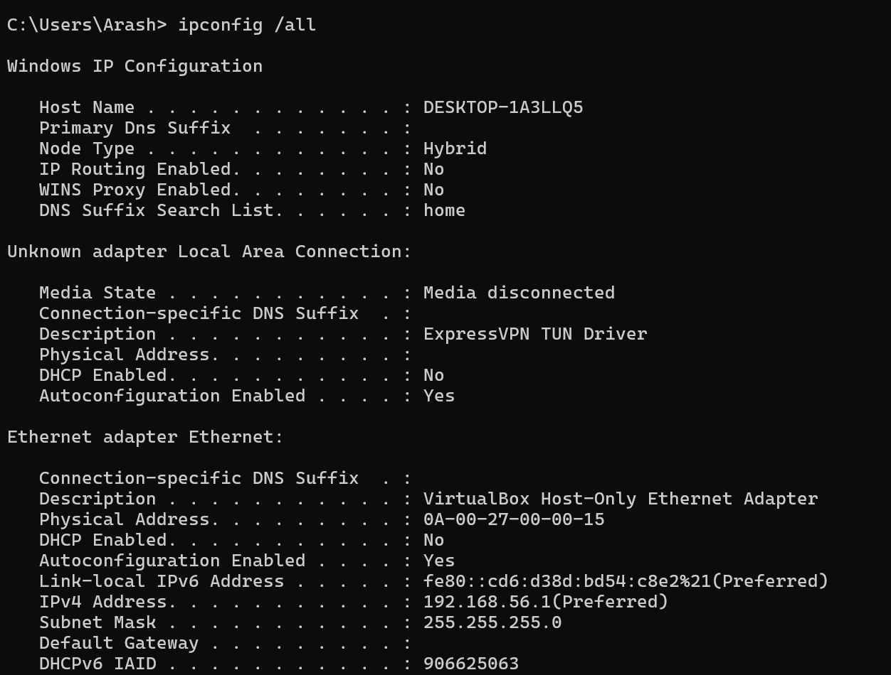

# سناریو: مشکل Ping

## شرح مشکل
سیستم قادر به ping کردن سرور 192.168.1.1 نیست.

## علائم
- Timeout
- Request timed out

## راه‌حل ساده (Network+ level)
1. بررسی کابل و اتصال فیزیکی
2. اجرای `ipconfig /all` برای بررسی IP و Gateway
3. اجرای `ping 192.168.1.1` برای تست اتصال
4. اصلاح IP یا کابل در صورت نیاز

## تصاویر خروجی

### وضعیت IP سیستم

### Ping به Gateway

