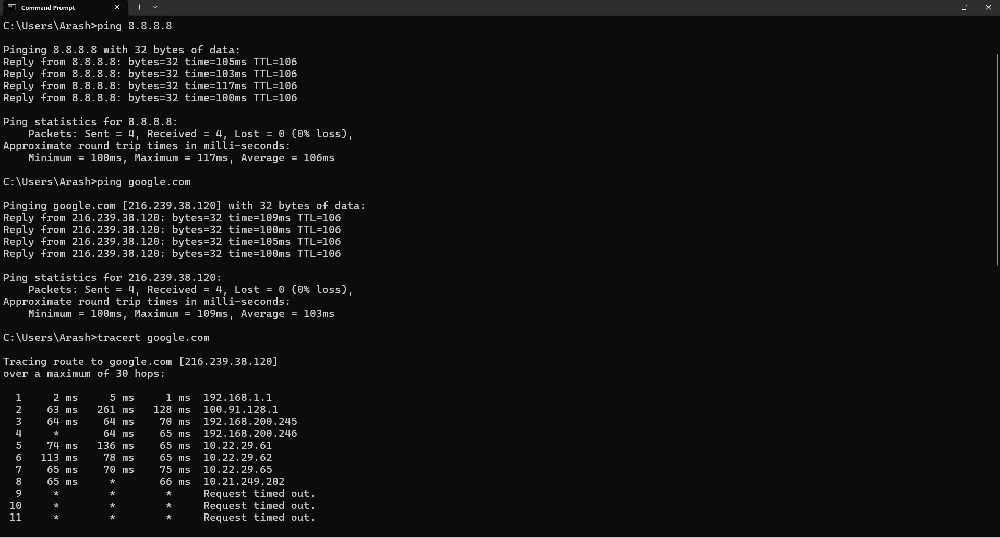

# سناریو: کندی شبکه / بررسی مسیر بسته‌ها

## شرح مشکل
ارتباط با یک سرور کند است یا بعضی بسته‌ها از مسیر شبکه گم می‌شوند.

## علائم
- صفحات وب دیر باز می‌شوند
- پینگ به سرور فاصله زیادی دارد یا بعضی بسته‌ها Timeout می‌شوند

## راه‌حل ساده (Network+ level)
1. اجرای `ping <server>` برای بررسی تأخیر اولیه
2. اجرای `tracert <server>` برای بررسی مسیر بسته‌ها
3. بررسی هر هاپ و زمان پاسخ آن‌ها
4. در صورت وجود تاخیر در یک هاپ خاص، مشکل می‌تواند از آن روتر یا مسیر باشد

  
 

