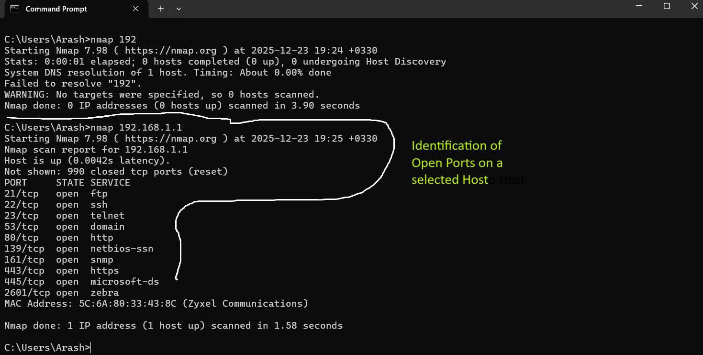

# Basic Network Audit Project

## Objective
The objective of this project is to perform a basic network audit on a local network
in order to identify active hosts and open ports using standard networking tools.

## Tools Used
- Nmap

 

## Port Scan
A basic port scan was conducted on a selected host to identify open ports and running services.

## Key Learnings
- Understanding IP ranges and subnetting
- Identifying active hosts on a network
- Recognizing open ports and associated services
- Gaining basic network security awareness

## Notes
This project was conducted in a controlled local environment for educational purposes only.
